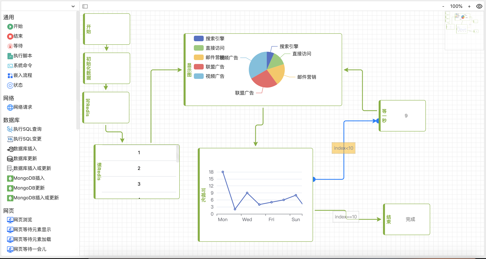
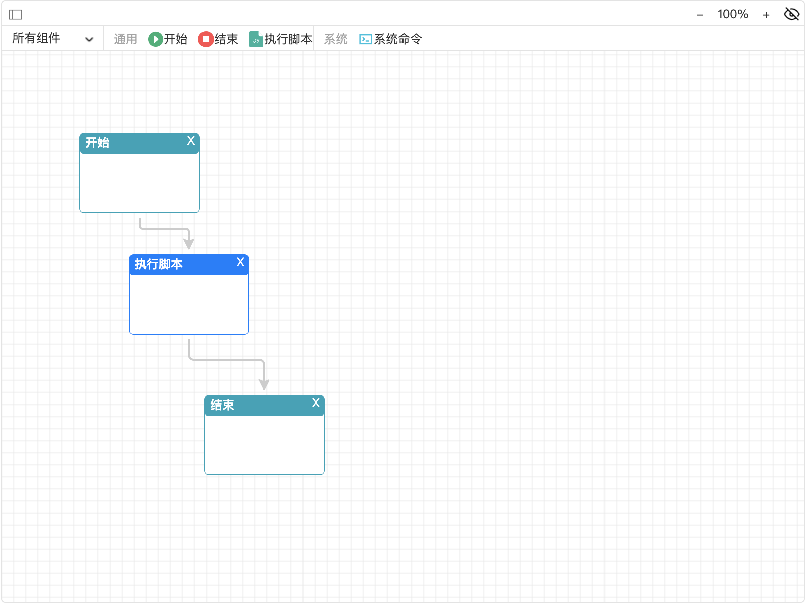
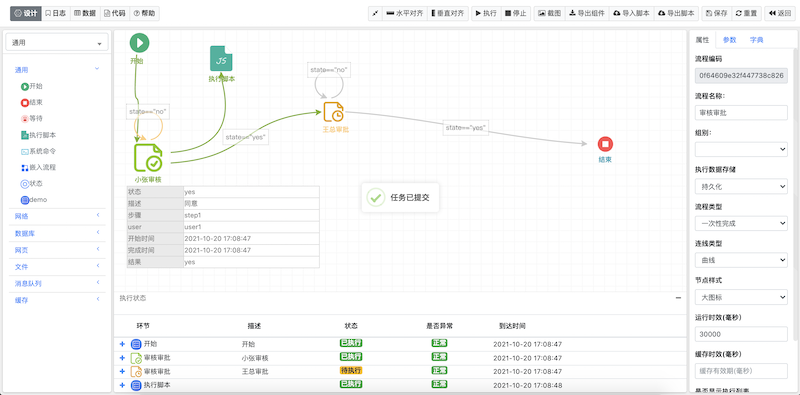
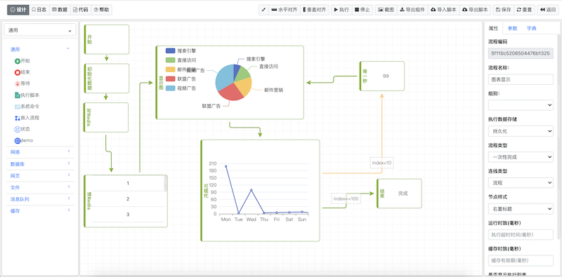
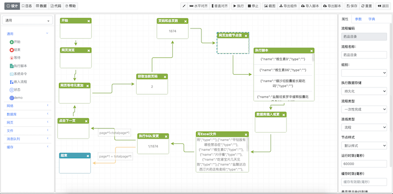
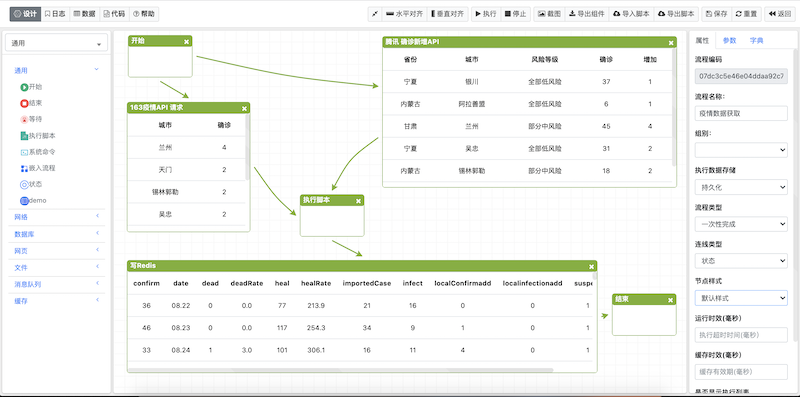
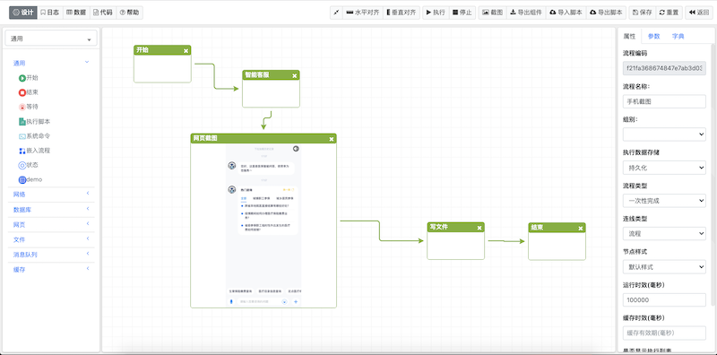
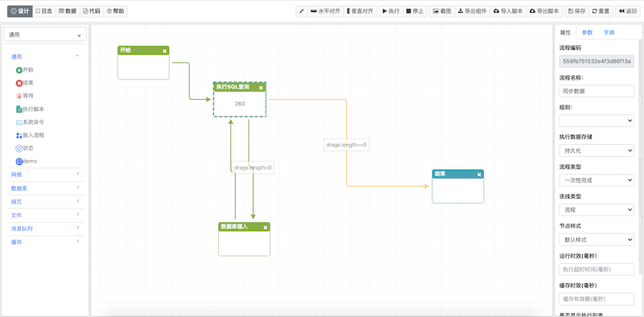
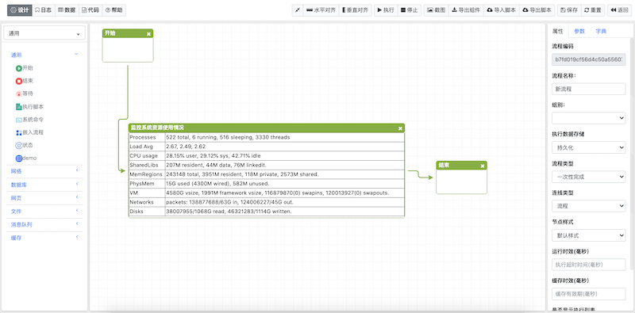
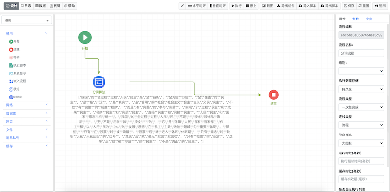

# 1.框架介绍
andflow_js是一个H5流程设计前端组件，是作为流程系统前端的其中一部分。可以快速实现各类流程设计，也可以根据业务和外观需要自定义界面渲染以及显示风格的前端组件。
目的是共同学习、交流心得。

## 文件结构 

* src 源代码
* depends 依赖包
* dist 目标代码
* examples 例子

# 2.DEMO




<table>
<tr>
<td> 


</td>
<td>


</td>
</tr>
<tr>
<td>


</td>
<td>


</td>

</tr>

<tr>
<td>


</td>
<td>


</td>
</tr>
<tr>
<td>


</td>
<td>


</td>
</tr>

</table>
 

# 3.开发说明

## 3.1 相关js依赖
* jquery
* jsplumb
* canvg.js
* html2canvas.min.js

## 3.2 开发

### 3.2.1引用依赖js
```html
<script src="/static/plugins/jquery/jquery.min.js"></script>
<script src="/static/plugins/jsplumb/js/jsplumb.min.js"></script>
<script src="/static/plugins/html2canvas/html2canvas.js"></script>
<script src="/static/plugins/canvg/canvg.js"></script>

```

### 3.2.2引用andflow_js相关css、js

```html 
    <link rel="stylesheet" href="/static/flow/css/andflow.css">
    <link rel="stylesheet" href="/static/flow/css/andflow_themes.css">

    <script src="/static/flow/js/andflow.js"></script>
    <script src="/static/flow/js/andflow_themes.js"></script>

```

### 3.2.3定义流程设计器的DOM
```html
<div id="andflow" style="width: 800px;height: 600px;padding:0px;">
</div>

```

### 3.2.4初始化流程设计器
```js

//流程组件过滤标签
var tags=['通用', '系统'];

//流程组件定义
var metadata=[
    {
        "name": "begin",
        "title": "开始",
        "des": "开始",
        "group": "通用",
        "tag": "通用",
        "css": "begin",
        "icon": "/static/flow/img/begin.png",
        "flow_code": "57edec62af8a42628714da6d1a045928",
        "params": [],
        "params_html": "",
        "params_script": ""
    },
    {
        "name": "end",
        "title": "结束",
        "des": "结束",
        "group": "通用",
        "tag": "通用",
        "css": "end",
        "icon": "/static/flow/img/end.png",
        "flow_code": "57edec62af8a42628714da6d1a045928",
        "params": [],
        "params_html": "",
        "params_script": ""
    },

    {
        "name": "script",
        "title": "执行脚本",
        "des": "",
        "group": "通用",
        "tag": "通用",
        "css": "",
        "icon": "/static/flow/img/script.png",
        "flow_code": "57edec62af8a42628714da6d1a045928",
        "params": [],
        "params_html": "",
        "params_script": ""
    },

    {
        "name": "cmd",
        "title": "系统命令",
        "des": "",
        "group": "系统",
        "tag": "系统",
        "css": "",
        "icon": "/static/flow/img/cmd.png",
        "flow_code": "57edec62af8a42628714da6d1a045928",
        "params": [
            {
                "name": "command",
                "title": "命令",
                "placeholder": "操作系统指令",
                "element": "textarea",
                "default": "",
                "attrs": {
                    "rows": "4"
                },
                "options": null,
                "option_mode": ""
            },
            {
                "name": "timeout",
                "title": "超时（毫秒）",
                "placeholder": "超时毫秒",
                "element": "input",
                "default": "10000",
                "attrs": {
                    "type": "number"
                },
                "options": null,
                "option_mode": ""
            },
            {
                "name": "cache",
                "title": "执行结果参数名",
                "placeholder": "执行结果存储到哪个参数变量",
                "element": "",
                "default": "",
                "attrs": null,
                "options": null,
                "option_mode": ""
            }
        ],
        "params_html": "",
        "params_script": ""
    }

] ;

var flowModel= {
    "code":"",
    "name":"",
    "show_action_body":"false",       //是否显示Body,默认true, flow_theme_icon比较有用
    "show_action_content":"true",     //是否显示节点内容,默认true
    "show_action_state_list":"false", //是否显示列表,默认false
    "theme":"flow_theme_default",     //节点风格,默认flow_theme_default
    "link_type":"Flowchart",          //连接线风格，默认Flowchart
   
    };


var options={
    //组件过滤标签列表
    tags:tags,            
    //组件元素
    metadata:metadata,    
    //流程模型
    flowModel:flowModel,  
    //是否可编辑，默认true
    editable:true,        
    //是否显示工具栏，默认true 
    show_toolbar:true,    
    //组件栏样式，可选项：固定左边metadata_fix_left、浮在左边metadata_float_left、浮在顶部metadata_float_top
    metadata_style:"",
    render_action:function(metadata,action,html){ return html; },//节点渲染
    render_action_helper: function(metadata,html){return null},  //节点拖拉渲染
    render_state_list: function(datas){return null},             //流程状态列表渲染
    render_link:function(conn,linktype,linkdata){return null},   //连接线渲染

    //节点单击事件
    event_action_click:function(metadata,action){

        var oldid=$("#current_action_id").val();
        andflow.setActionSelected(oldid,false);

        $("#current_action_id").val(action.id);
        andflow.setActionSelected(action.id,true);

    },
    //节点双击事件
    event_action_dblclick:function(metadata,action){

        var content = prompt("set action content ");

        andflow.setActionContent(action.id,content);

    },
    //连线单击事件
    event_link_click: function (link) {
        alert("link  click");
    },
    //连线双击事件
    event_link_dblclick: function (link) {
        var label = prompt("set link label ");
        link.title=label;
        andflow.setLinkInfo(link);

    },
    //画图板单击事件
    event_canvas_click: function(e){
        var oldid=$("#current_action_id").val();
        andflow.setActionSelected(oldid,false);
        $("#current_action_id").val("");
    }
}

//初始化流程设计器实例
andflow.newInstance("andflow",options);
//显示流程设计器
andflow.showFlow();
```


# 4.参数

## 4.1.设计器选项options
<table>
<tr>
<td>名称</td><td>描述</td><td>值</td><td>默认值</td>
</tr>
<tr>
<td>tags</td><td>组件标签列表</td><td>数组</td><td>null</td>
</tr>
<tr>
<td>metadata</td><td>组件定义元数据</td><td>数组</td><td>null</td>
</tr>
<tr>
<td>editable</td><td>是否可设计</td><td>true/false</td><td>true</td>
</tr>
<tr>
<td>flowModel</td><td>流程模型</td><td>object</td><td>null</td>
</tr>
<tr>
<td>render_action</td><td>组件节点渲染函数</td><td>function(metadata,action,html){ return null; }</td><td>null</td>
</tr>
<tr>
<td>render_action_helper</td><td>组件节点拖拉过程渲染函数</td><td>function(metadata,html){ return null; }</td><td>null</td>
</tr>
<tr>
<td>render_endpoint</td><td>组件节点拖拉点渲染函数</td><td>function(metadata,action,html){ return null; }</td><td>null</td>
</tr>
<tr>
<td>render_removebtn</td><td>组件节点拖拉点渲染函数</td><td>function(metadata,action,html){ return null; }</td><td>null</td>
</tr>
<tr>
<td>render_link</td><td>组件节点连线渲染函数</td><td>function(conn,linktype,linkdata){return null}</td><td>null</td>
</tr>

<tr>
<td>event_action_click</td><td>节点单击事件</td><td>function(metadata,action){}</td><td>null</td>
</tr>
<tr>
<td>event_action_dblclick</td><td>节点双击事件</td><td>function(metadata,action){}</td><td>null</td>
</tr>

<tr>
<td>event_link_click</td><td>连线单击事件</td><td>function (link)</td><td>null</td>
</tr>

<tr>
<td>event_link_dblclick</td><td>连线双击事件</td><td>function (link)</td><td>null</td>
</tr>
<tr>
<td>event_canvas_click</td><td>画布单击事件</td><td>function (event)</td><td>null</td>
</tr>

</table>

### 4.1.1组件元数据定义metadata

metadata 参数用于定义流程设计器的组件列表

```js
var metadata=[
    {
        "name": "begin",
        "title": "开始",
        "des": "开始",
        "group": "通用",
        "tag": "通用", 
        "icon": "/static/flow/img/begin.png", 
        "params": [
                {
                    "name": "command",
                    "title": "命令",
                    "placeholder": "操作系统指令",
                    "element": "textarea",
                    "default": "",
                    "attrs": {
                        "rows": "4"
                    },
                    "options": null,
                    "option_mode": ""
                },
        ],
        "params_html": "",
        "params_script": ""
    },
]

```

<table>
<tr>
<td>名称</td>
<td>描述</td>
<td>取值</td>  
</tr>
<tr>
<td>name</td>
<td>组件名称</td>
<td>唯一字符串</td>  
</tr>
<tr>
<td>title</td>
<td>组件标题</td>
<td>中英文标题</td>  
</tr>
<tr>
<td>group</td>
<td>组件所属组别</td>
<td>中英文名称</td>  
</tr>
<tr>
<td>tag</td>
<td>组件标签，用于过滤</td>
<td>中英文名称</td>  
</tr>
<tr>
<td>css</td>
<td>组件样式</td>
<td>CSS样式名称</td>  
</tr>

<tr>
<td>icon</td>
<td>组件图标</td>
<td>图标路径或者使用base64格式（例如 data:image/png;base64,....）</td>  
</tr>

<tr>
<td>params</td>
<td>组件设计参数数组</td>
<td>这个部分可以自定义</td>  
</tr>
<tr>
<td>params</td>
<td>组件设计参数数组</td>
<td>这个部分可以自定义</td>  
</tr>
<tr>
<td>params_html</td>
<td>组件设计参数设置界面HTMl</td>
<td>这个部分可以自定义</td>  
</tr>
<tr>
<td>params_script</td>
<td>组件设计参数设置界面javascript</td>
<td>这个部分可以自定义</td>  
</tr>
</table>


### 4.1.2流程模型参数flowModel
用于默认显示的流程模型，也可以放空。

例如：
```js
    var flowModel= {
        "code":"",
        "name":"",
        "show_action_body":"false",       //是否显示Body,默认true, flow_theme_icon比较有用
        "show_action_content":"true",     //是否显示节点内容,默认true
        "show_action_state_list":"false", //是否显示列表,默认false
        "theme":"flow_theme_default",     //节点风格,默认flow_theme_default
        "link_type":"Flowchart",          //连接线风格，默认Flowchart
        "params":[],
        // "actions":[{"id":"f7a6ec0031784f5a80d8633a6418fd52","left":"77px","top":"101px","name":"begin","params":{},"title":"开始","icon":"/static/flow/img/begin.png","width":"120px","height":"80px"},{"id":"793a2a11cf8b40e9afd8bd8f04405e64","left":"126px","top":"222px","name":"script","params":{},"title":"执行脚本","icon":"/static/flow/img/script.png","width":"120px","height":"80px"},{"id":"f558687ca5f34a6c89732eb50749a15a","left":"201px","top":"362px","name":"end","params":{},"title":"结束","icon":"/static/flow/img/end.png","width":"120px","height":"80px"}],
        // "links":[{"source_id":"f7a6ec0031784f5a80d8633a6418fd52","target_id":"793a2a11cf8b40e9afd8bd8f04405e64"},{"source_id":"793a2a11cf8b40e9afd8bd8f04405e64","target_id":"f558687ca5f34a6c89732eb50749a15a"}]
    };
```

流程模型对象内的相关参数为：

<table>
<tr>
<td>名称</td>
<td>描述</td>
<td>取值</td>  
<td>默认</td>  
</tr>
<tr>
<td>code</td>
<td>流程唯一编码</td>
<td>字符串</td>  
<td>null</td>  
</tr>
<tr>
<td>name</td>
<td>流程名称</td>
<td>字符串</td>  
<td>null</td>  
</tr>
<tr>
<td>theme</td>
<td>组件节点样式</td>
<td>flow_theme_default、flow_theme_icon、flow_theme_zone、也可以自定义</td>  
<td>flow_theme_default</td>  
</tr>
<tr>
<td>link_type</td>
<td>连线样式</td>
<td>Flowchart、Straight、Bezier、StateMachine</td>  
<td>Flowchart</td>  
</tr>
<tr>
<td>show_action_body</td>
<td>是否显示组件节点中的Body部分</td>
<td>“true"、“false"</td>  
<td>"true"</td>  
</tr>
<tr>
<td>show_action_content</td>
<td>是否显示组件节点中的内容</td>
<td>“true"、“false"</td>  
<td>"true"</td>  
</tr>
<tr>
<td>show_action_state_list</td>
<td>是否显示流程状态列表</td>
<td>“true"、“false"</td>  
<td>"false"</td>  
</tr>
<tr>
<td>actions</td>
<td>节点列表：可以在设计后自动生成</td>
<td>object</td>  
<td>null</td>  
</tr>
<td>actions</td>
<td>连线列表：可以设计后自动生成</td>
<td>object</td>  
<td>null</td>  
</tr>

</table>

## 4.2 方法
<table>
<tr>
<td>名称</td>
<td>描述</td>
<td>参数</td>  
<td>返回值</td>  
<td>DEMO</td>  
</tr>
<tr>
<td>andflow.showFlow();</td>
<td>显示流程模型</td>
<td>flowModel，可以为空</td>  
<td>null</td>  
<td></td>
</tr>
<tr>
<td>andflow.getFlow();</td>
<td>获取流程模型对象</td>
<td>null</td>  
<td>flowModel</td>  
<td></td>
</tr>
<tr>
<td>andflow.snap("流程");</td>
<td>截图</td>
<td>截图导出的文件名称</td>  
<td>null</td>  
</tr>

<tr>
<td>andflow.setTheme(theme);</td>
<td>设置组件节点样式名称</td>
<td>flow_theme_default、flow_theme_icon、flow_theme_zone、或者其他自定义</td>  
<td>null</td>  
<td>
andflow.setTheme(theme);
andflow.reflow();
</td>
</tr>

<tr>
<td>andflow.setLinkType(link_type);</td>
<td>设置连接线样式名称</td>
<td>Flowchart、Straight、Bezier、StateMachine</td>  
<td>null</td>  
<td>
andflow.setLinkType(link_type);
andflow.reflow();
</td>
</tr>

<tr>
<td>andflow.setEditable(false);</td>
<td>设置是否可设计</td>
<td>true、false</td>  
<td>null</td>  
<td></td>
</tr>

<tr>
<td>andflow.reflow();</td>
<td>重新渲染设计器,在改变样式、风格之后需要执行这个函数。</td>
<td>null</td>  
<td>null</td>  
<td></td>
</tr>

<tr>
<td>andflow.getLinkInfo(sourceId, targetId);</td>
<td>获取连线信息</td>
<td>sourceId：起始节点ID, targetId：目的节点ID</td>  
<td>连线信息</td>  
<td></td>
</tr>
<tr>
<td>andflow.setLinkInfo(linkInfo);</td>
<td>设置连线信息</td>
<td>linkInfo连线信息</td>  
<td>null</td>  
<td></td>
</tr>


<tr>
<td>andflow.getLinkLabel(source_id,target_id);</td>
<td>获取连线中间标签标题</td>
<td>sourceId：起始节点ID, targetId：目的节点ID</td>  
<td>标签标题</td>  
<td></td>
</tr>
<tr>
<td>andflow.setLinkLabel(source_id,target_id,title);</td>
<td>设置连线中间标签标题</td>
<td>sourceId：起始节点ID, targetId：目的节点ID,title:标题</td>  
<td>null</td>  
<td></td>
</tr>

<tr>
<td>andflow.removeLink(sourceId, targetId);</td>
<td>删除链接线</td>
<td>sourceId：起始节点ID, targetId：目的节点ID</td>  
<td>null</td>  
<td></td>
</tr>

<tr>
<td>andflow.getActionInfo(actionId);</td>
<td>获取节点配置信息</td>
<td>actionId：节点ID</td>  
<td>节点信息</td>  
<td></td>
</tr>
<tr>
<td>andflow.setActionInfo(actionInfo);</td>
<td>设置节点配置信息</td>
<td> actionInfo：节点信息</td>  
<td>null</td>  
<td></td>
</tr>
<tr>
<td>andflow.setActionContentVisible(true);</td>
<td>设置内容是否可见</td>
<td>true、false</td>  
<td>null</td>  
<td></td>
</tr>
<tr>
<td>andflow.setActionParam(actionId,key,value);</td>
<td>设置节点参数。</td>
<td>actionId：节点ID,key：参数名,value：参数值</td>  
<td>null</td>  
<td></td>
</tr>
<tr>
<td>andflow.getActionParam(actionId,key);</td>
<td>设置节点参数。</td>
<td>actionId：节点ID,key：参数名</td>  
<td>参数值</td>  
<td></td>
</tr>
<tr>
<td>andflow.removeAction(actionId);</td>
<td>删除节点</td>
<td>actionId：节点ID</td>  
<td></td>  
<td></td>
</tr>

<td>andflow.getGroupInfo(groupId);</td>
<td>获取组配置信息</td>
<td>groupId：组ID</td>  
<td>组信息</td>  
<td></td>
</tr>
<tr>
<td>andflow.setGroupInfo(groupInfo);</td>
<td>设置组配置信息</td>
<td>groupInfo：组信息</td>  
<td>null</td>  
<td></td>
</tr>

<td>andflow.getGroupTitle(groupId);</td>
<td>获取组标题</td>
<td>groupId：组ID</td>  
<td>组标题</td>  
<td></td>
</tr>
<tr>
<td>andflow.setGroupTitle(groupId,title);</td>
<td>设置组标题</td>
<td>groupId：组ID, title:组标题</td>  
<td>null</td>  
<td></td>
</tr>
<tr>
<td>andflow.removeGroup(groupId,deleteMembers);</td>
<td>设置组标题</td>
<td>groupId：组ID, deleteMembers: 是否删除子元素（true,false)</td>  
<td>null</td>  
<td></td>
</tr> 
</table>


## 4.3 事件
<table>
<tr>
<td>事件</td>
<td>名称</td>
<td>事件函数签名</td>
<td>描述</td>
</tr>
<tr>
<td>event_action_click</td>
<td>节点单击</td>
<td>event_action_click(action_meta, action)  </td>
<td>action_meta节点配置信息, action:节点信息  </td>
</tr>
<tr>
<td>event_action_dblclick</td>
<td>节点双击</td>
<td>event_action_dblclick(action_meta, action)  </td>
<td>action_meta节点配置信息, action:节点信息  </td>
</tr>
<tr>
<td>event_action_remove</td>
<td>节点被删除</td>
<td>event_action_remove( action)  </td>
<td> action:节点信息  </td>
</tr>
<tr>
<td>event_link_click</td>
<td>连接线单击</td>
<td>event_link_click(linkinfo)  </td>
<td>linkinfo:链接线信息  </td>
</tr>
<tr>
<td>event_link_dblclick</td>
<td>连接线双击</td>
<td>event_link_dblclick(linkinfo)  </td>
<td>linkinfo:链接线信息  </td>
</tr>
<tr>
<td>event_link_remove</td>
<td>连接线被删除</td>
<td>event_link_remove(linkinfo)  </td>
<td>linkinfo:链接线信息  </td>
</tr>
<tr>
<td>event_canvas_click</td>
<td>设计面板单击</td>
<td>event_canvas_click(event)  </td>
<td>event:事件  </td>
</tr>
<tr>
<td>event_canvas_changed</td>
<td>设计面板被调整</td>
<td>event_canvas_changed()  </td>
<td>null</td>
</tr>
</table>   